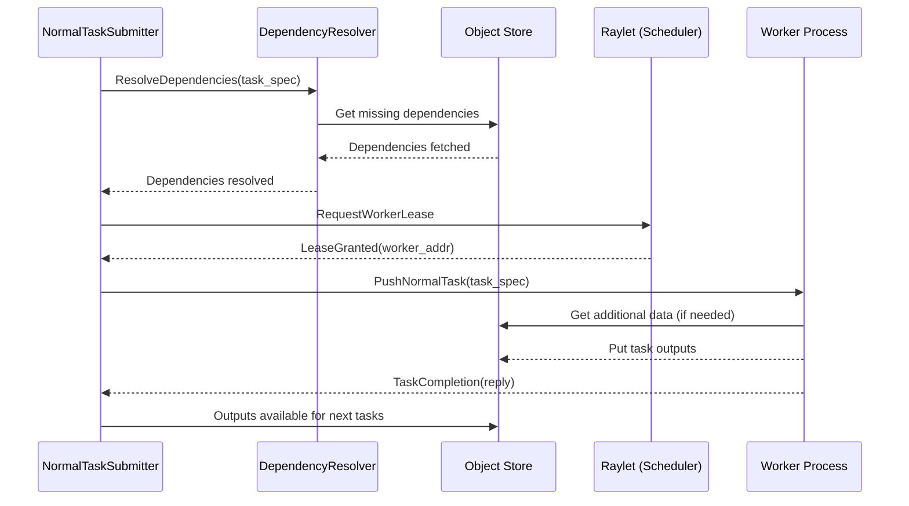

# Rays execution flow

## Overview




## 1. Initialization
When we call 


 `@ray.remote` creates a stateless task when it is called on a function but a stateful actor when it is called on a class method.
 A task is executed asynchronously with the caller: the `.remote()` call immediately returns one or more `ObjectRefs` (futures) that can be used to retrieve the return value(s).

 Objects are application value that are either returned by a task or created by the `@ray.put` call. they are **immutable** and can be called by the workers using the *ObjectRefs*

 Each worker process and raylet is assigned a unique 28-byte identifier and an IP address and port. The same address and port can be reused by subsequent components (e.g., if a previous worker process dies), but the unique IDs are never reused (i.e., they are tombstoned upon process death). Worker processes fate-share with their local raylet process.


## Code references:
    - **Backbone for each worker:** src/ray/core_worker/core_worker.cc
    - **Language bindings for Python**: IncrementalRay/python/ray/includes/libcoreworker.pxd
    - **Task spec definition**: src/ray/common/task/task_spec.h
    - **Task spec protobuf definition**: src/ray/protobuf/common.proto
    - **Caller code for requesting a worker lease and sending the task to the leased worker**: src/ray/core_worker/transport/direct_task_transport.cc
    - **Local dependency resolution, before a worker lease is requested**: src/ray/core_worker/transport/dependency_resolver.cc
    - **Manager for all called tasks that are still pending**: src/ray/core_worker/task_manager.cc - 
    - **Runs on Python workers to fetch function definitions** : python/ray/_private/function_manager.py


## 2. Task Definition

Fucntions that are decorated with `@ray.remote` are called *task* functions that can be executed remotely.

Python Layer: The task submission begins in the Python code, where the function decorated with `@ray.remote` is called with `.remote()`. This eventually calls `worker.core_worker.submit_task()` in the `remote_function.py` file.

```python
# python/ray/remote_function.py
class RemoteFunction:
    ...
    def remote(self, *args, **kwargs):
        return self._remote(args=args, kwargs=kwargs)
```


C++ Core Worker: The submit_task() method in the Python CoreWorker class is a wrapper that interfaces with the C++ Core Worker. In the C++ layer, CoreWorker::SubmitTask in IncrementalRay/src/ray/core_worker/core_worker.cc is called.

``` c++
// src/ray/core_worker/core_worker.cc

std::vector<rpc::ObjectReference> CoreWorker::SubmitTask(
    const RayFunction &function,
    const std::vector<std::unique_ptr<TaskArg>> &args,
    const TaskOptions &task_options,
    int max_retries,
    bool retry_exceptions,
    const rpc::SchedulingStrategy &scheduling_strategy,
    const std::string &debugger_breakpoint,
    const std::string &serialized_retry_exception_allowlist,
    const TaskID current_task_id) {
  RAY_CHECK(scheduling_strategy.scheduling_strategy_case() !=
            rpc::SchedulingStrategy::SchedulingStrategyCase::SCHEDULING_STRATEGY_NOT_SET);

  // 1. Create a TaskSpecBuilder to build the task specification.
  TaskSpecBuilder builder;
  const auto next_task_index = worker_context_.GetNextTaskIndex();

  // 2. Generate a unique TaskID for the new task.
  const auto task_id = TaskID::ForNormalTask(
      worker_context_.GetCurrentJobID(),
      worker_context_.GetCurrentInternalTaskId(),
      next_task_index);

  // 3. Handle resource constraints and task naming.
  auto constrained_resources =
      AddPlacementGroupConstraint(task_options.resources, scheduling_strategy);
  auto task_name = task_options.name.empty()
                       ? function.GetFunctionDescriptor()->DefaultTaskName()
                       : task_options.name;

  // 4. Build the common task specification.
  BuildCommonTaskSpec(builder,
                      worker_context_.GetCurrentJobID(),
                      task_id,
                      task_name,
                      current_task_id != TaskID::Nil() ? current_task_id
                                                       : worker_context_.GetCurrentTaskID(),
                      next_task_index,
                      GetCallerId(),
                      rpc_address_,
                      function,
                      args,
                      task_options.num_returns,
                      constrained_resources,
                      task_options.placement_resources,
                      debugger_breakpoint,
                      worker_context_.GetTaskDepth() + 1,
                      serialized_runtime_env_info_,
                      worker_context_.GetMainThreadOrActorCreationTaskID(),
                      task_options.concurrency_group_name,
                      task_options.include_job_config,
                      task_options.generator_backpressure_num_objects,
                      task_options.enable_task_events);

  // 5. Build the TaskSpecification object from the builder.
  TaskSpecification task_spec = builder.Build();

  // Log the task submission
  RAY_LOG(DEBUG) << "Submitting normal task " << task_spec.DebugString();

  // Initializes a vector to store references to the task's return objects.
  std::vector<rpc::ObjectReference> returned_refs;

  if (options_.is_local_mode) {
    // Execute the task locally without Ray cluster
    returned_refs = ExecuteTaskLocalMode(task_spec);
  } else {
    // Add the task to the task manager's pending tasks
    returned_refs = task_manager_->AddPendingTask(
        task_spec.CallerAddress(), task_spec, CurrentCallSite(), max_retries);

    // Post the task submission to the IO service event loop
    io_service_.post(
        [this, task_spec]() {
          // Submit the task using the normal task submitter
          RAY_UNUSED(normal_task_submitter_->SubmitTask(task_spec));
        },
        "CoreWorker.SubmitTask");
  }

  return returned_refs;
}
```

So if *options_.is_local_mode* is true, the task is executed synchronously in the local process without using Ray's distributed scheduling.
The method *ExecuteTaskLocalMode(task_spec)* handles this execution.

If not in local mode, the task submission proceeds using Ray's distributed execution framework.

It then adds the tasks to the TaskManager's pending tasks that manages the task metadata and handles retries upon failures. it returns references to the task's output objects. So the TaskManager keeps track of all the tasks that have been submitted but not completed and bookkeeping for task retries also.
This task manager is local, more specifically it is a member of the CoreWorker class.

`io_service_.post(...)`
An instance of boost::asio::io_service
Schedules the provided lambda function to be executed in the IO service's event loop. This ensures that task submission is non-blocking and handled asynchronously.
Lambda Function:
Captures this pointer and task_spec by value.
Calls normal_task_submitter_->SubmitTask(task_spec) to submit the task.
RAY_UNUSED is used to explicitly ignore the return value of SubmitTask.

`return returned_refs;`
Returns the references to the task's output objects to the caller.
These references can be used to fetch the actual results once the task execution is complete.

 ### How to recover missing dependencies:
In `TaskSpecification` class there is a method `GetDependecnyIds()`, this retruns the ObjectIds of any dependencies passed by reference to this task

NormalTaskSubmitter: The NormalTaskSubmitter::SubmitTask method in normal_task_submitter.cc handles the actual submission of normal tasks. It resolves dependencies, worker leasing, and dispatching tasks to workers for execution.
File: IncrementalRay/src/ray/core_worker/transport/normal_task_submitter.cc

``` c++
// src/ray/core_worker/transport/normal_task_submitter.cc
Status NormalTaskSubmitter::SubmitTask(TaskSpecification task_spec) { // checks that the task is indeed normal task
  RAY_CHECK(task_spec.IsNormalTask());
  RAY_LOG(DEBUG) << "Submit task " << task_spec.TaskId();
  num_tasks_submitted_++; // increment the counter for number of tasks submitted

  resolver_.ResolveDependencies(task_spec, [this, task_spec](Status status) mutable { // calls the resolver_.ResolveDependencies() to ensure that all the dependencies are available before executing the tasks
    // NOTE: task_spec here is capture copied (from a stack variable) and also
    // mutable. (Mutations to the variable are expected to be shared inside and
    // outside of this closure).
    task_finisher_->MarkDependenciesResolved(task_spec.TaskId());
    if (!status.ok()) {
      // if the dependencies are not resolved, log a warning and fail the task
      RAY_LOG(WARNING) << "Resolving task dependencies failed " << status.ToString();
      RAY_UNUSED(task_finisher_->FailOrRetryPendingTask(
          task_spec.TaskId(), rpc::ErrorType::DEPENDENCY_RESOLUTION_FAILED, &status));
      return;
    }
    // proceed with the task submission
    RAY_LOG(DEBUG) << "Task dependencies resolved " << task_spec.TaskId();
    // check if the task is cancelled
    bool keep_executing = true;
    {
      absl::MutexLock lock(&mu_);
      if (cancelled_tasks_.find(task_spec.TaskId()) != cancelled_tasks_.end()) {
        cancelled_tasks_.erase(task_spec.TaskId());
        keep_executing = false;
      }
      if (keep_executing) { // queue the task for execution
        task_spec.GetMutableMessage().set_dependency_resolution_timestamp_ms(
            current_sys_time_ms());
        // Note that the dependencies in the task spec are mutated to only contain
        // plasma dependencies after ResolveDependencies finishes.
        // Create or retrieve scheduling key for the task
        const SchedulingKey scheduling_key(task_spec.GetSchedulingClass(),
                                           task_spec.GetDependencyIds(),
                                           task_spec.IsActorCreationTask()
                                               ? task_spec.ActorCreationId()
                                               : ActorID::Nil(),
                                           task_spec.GetRuntimeEnvHash());
        auto &scheduling_key_entry = scheduling_key_entries_[scheduling_key];
        // adding the task to the task_queue associated with its scheduling key
        scheduling_key_entry.task_queue.push_back(task_spec);
        // stores the resource requirements of the task under the scheduling key
        scheduling_key_entry.resource_spec = task_spec;

        if (!scheduling_key_entry.AllWorkersBusy()) {
          // There are idle workers, so we don't need more
          // workers.

          for (const auto &active_worker_addr : scheduling_key_entry.active_workers) {
            RAY_CHECK(worker_to_lease_entry_.find(active_worker_addr) !=
                      worker_to_lease_entry_.end());
            auto &lease_entry = worker_to_lease_entry_[active_worker_addr];
            if (!lease_entry.is_busy) {
              OnWorkerIdle(active_worker_addr,
                           scheduling_key,
                           /*was_error*/ false,
                           /*error_detail*/ "",
                           /*worker_exiting*/ false,
                           lease_entry.assigned_resources);
              break;
            }
          }
        }
        RequestNewWorkerIfNeeded(scheduling_key);
      }
    }
    if (!keep_executing) { // if the task is cancelled, fail the task
      RAY_UNUSED(task_finisher_->FailOrRetryPendingTask(
          task_spec.TaskId(), rpc::ErrorType::TASK_CANCELLED, nullptr));
    }
  });
  return Status::OK();
}
```


### Scheduling Key: 
  - Combines the task's scheduling class, dependency IDs, actor ID(if any), and runtime environment hash.
  - Groups tasks with similar resource requirements and dependencies together.

Task Queuing takes place in the *scheduling_key_entries_* map. and also stores the resource req. for each task! seee comment in the code above.


### Worker Management/Leasing:

The `NormalTaskSubmitter` checks for idle workers in the `active_workers` set for a task's `SchedulingKey`. Since initially no workers exist yet, there are not idle workers. So the `NormalTaskSubmitter` calls `RequestNewWorkerIfNeeded()` to lease a new worker from the Raylet. the Raylet will spawn a new worker, lets call it worker 1, worker 1 is now added to the `active_workers` set and marked as idle initially. Then the `OnWorkerIdle()` method is called because a new idle worker is available. The task is now assigned to this idle worker and it is marked as busy and then this task is remvoed from the task queue. Now when another task is submitted, the `NormalTaskSubmitter` checks for idle workers in the active_workers set for this task's SchedulingKey. Since worker 1 is busy executing the previous task, it calls `RequestNewWorkerIfNeeded()` again to lease a new worker, fastforward it is assgined the task that was pending, now when Task A completes. A callback is invoked to handle the task completion (discussed later) and worker 1 is marked as idle. Now if there are any further tasks they can be assigned to this idle worker 1.
> Some key points:
> - Workers are reused to execute multiple tasks and this reduces overhead of spawning a new process for every task.
> - New workers are leased (spawned) only when there are pending tasks and no idle workers to execute them.

Workers can maintain cached data or open connections between tasks. Especially beneficial for tasks that could benefit from warm caches. ???

  - IdleWorkers:
    It checks if any workers asscoiated with the scheduling key are idle, if yes it calls the `OnWorkerIdle()` method to assign the tasks to the idle workers.

  - Busy Workers:
    If all workers are busy, calls `RequestNewWorkerIfNeeded()` to lease a new worker from the Raylet.


``` c++
// src/ray/core_worker/transport/normal_task_submitter.cc Lines(146-197)
void NormalTaskSubmitter::OnWorkerIdle(
    const rpc::Address &addr,
    const SchedulingKey &scheduling_key,
    bool was_error,
    const std::string &error_detail,
    bool worker_exiting,
    const google::protobuf::RepeatedPtrField<rpc::ResourceMapEntry> &assigned_resources) {
  // Check if the worker is valid and not already busy.
  // Assign tasks from the queue to the worker.
}
```
Ensures that the worker is valid adn not already executing a task. there is a task assignment `while` loop that assigns tasks to the worker if it is idle and there are still tasks in the queue. it pops a task from the queue and assigns the worker, then marks the worker as busy and then increments the number of busy workers. The `PushNormalTask()` method is then called to push the task to the worker for execution.

``` c++
// src/ray/core_worker/transport/normal_task_submitter.cc Lines(547-646)
void NormalTaskSubmitter::PushNormalTask(
    const rpc::Address &addr,
    std::shared_ptr<rpc::CoreWorkerClientInterface> client,
    const SchedulingKey &scheduling_key,
    const TaskSpecification &task_spec,
    const google::protobuf::RepeatedPtrField<rpc::ResourceMapEntry> &assigned_resources) {
  // Prepare the PushTaskRequest.
  auto request = std::make_unique<rpc::PushTaskRequest>();

  // NOTE(from the authors of Ray): CopyFrom is needed because if we use Swap here and the task
  // fails, then the task data will be gone when the TaskManager attempts to
  // access the task.
  request->mutable_task_spec()->CopyFrom(task_spec.GetMessage());
  request->mutable_resource_mapping()->CopyFrom(assigned_resources);
  request->set_intended_worker_id(addr.worker_id());

  // Send the task to the worker.
  client->PushNormalTask(
      std::move(request),
      [this, task_spec, task_id, scheduling_key, addr, assigned_resources]
      (Status status, const rpc::PushTaskReply &reply) {
        // Handle task success or failure.
      });
}
```

The Task is prepared by copying the TaskSpec and the ResourceMapping from the TaskSpecification object. The intended worker ID is set to the worker address. The `client->PushNormalTask()` method sends the task over gRPC to the worker for execution.

The callback function is used to handle the task success or failure.

The task completion is handled by

``` c++
// src/ray/core_worker/transport/normal_task_submitter.cc Lines(573-648)
 client->PushNormalTask(
      std::move(request),
      [this,
       task_spec,
       task_id,
       is_actor,
       is_actor_creation,
       scheduling_key,
       addr,
       assigned_resources](Status status, const rpc::PushTaskReply &reply) {
        {
          RAY_LOG(DEBUG) << "Task " << task_id << " finished from worker "
                         << WorkerID::FromBinary(addr.worker_id()) << " of raylet "
                         << NodeID::FromBinary(addr.raylet_id());
          // uses Mutexe lock (mu_) for protecting shared data structure in multi-threaded contexts.
          absl::MutexLock lock(&mu_);
          // removes the task from the executing_tasks_ map
          executing_tasks_.erase(task_id);

          // Decrement the number of tasks in flight to the worker
          auto &lease_entry = worker_to_lease_entry_[addr];
          // checks if the worker is busy which should always be true here
          RAY_CHECK(lease_entry.is_busy);
          //  marks the worker as idle since it has finiched executing.
          lease_entry.is_busy = false;

          // Decrement the total number of tasks in flight to any worker with the current
          // scheduling_key.
          // some checks and then decrements the count of busy workers for this scheduling key, that reflects the worker is now idle.
          auto &scheduling_key_entry = scheduling_key_entries_[scheduling_key];
          RAY_CHECK_GE(scheduling_key_entry.active_workers.size(), 1u);
          RAY_CHECK_GE(scheduling_key_entry.num_busy_workers, 1u);
          scheduling_key_entry.num_busy_workers--;

          // if the task execution failed, get the failure cause from the raylet.
          if (!status.ok()) {
            RAY_LOG(DEBUG) << "Getting error from raylet for task " << task_id;
            const ray::rpc::ClientCallback<ray::rpc::GetTaskFailureCauseReply> callback =
                [this, status, is_actor, task_id, addr](
                    const Status &get_task_failure_cause_reply_status,
                    // reply from the raylet as why the task failed.
                    const rpc::GetTaskFailureCauseReply &get_task_failure_cause_reply) {
                  HandleGetTaskFailureCause(status,
                                            is_actor,
                                            task_id,
                                            addr,
                                            get_task_failure_cause_reply_status,
                                            get_task_failure_cause_reply);
                };
            auto &lease_entry = worker_to_lease_entry_[addr];
            RAY_CHECK(lease_entry.lease_client);
            lease_entry.lease_client->GetTaskFailureCause(lease_entry.task_id, callback);
          }

          // if the task execution failed or the task is an actor creation task or the worker is exiting, the worker is marked as idle.
          if (!status.ok() || !is_actor_creation || reply.worker_exiting()) {
            bool was_error = !status.ok();
            bool is_worker_exiting = reply.worker_exiting();
            // Successful actor creation leases the worker indefinitely from the raylet.
            OnWorkerIdle(addr,
                         scheduling_key,
                         /*error=*/was_error,
                         /*error_detail*/ status.message(),
                         /*worker_exiting=*/is_worker_exiting,
                         assigned_resources);
          }
        }
        // now we are outside the mutex lock, and here we handle if the task succeeded
        if (status.ok()) {
          // Checks if the task was cancelled before it began execution on the worker.
          if (reply.was_cancelled_before_running()) {
            RAY_LOG(DEBUG) << "Task " << task_id
                           << " was cancelled before it started running.";
            // if the task was cancelled before it began execution, it is failed.
            RAY_UNUSED(
                task_finisher_->FailPendingTask(task_id, rpc::ErrorType::TASK_CANCELLED));
                // task completed or needs a retry, the task is not configured to retry upon exception, or the task is not retryable, or it attempts to retry the task and returns false if it cannot or should not be retried.
          } else if (!task_spec.GetMessage().retry_exceptions() ||
                     !reply.is_retryable_error() ||
                     !task_finisher_->RetryTaskIfPossible(
                         task_id,
                         gcs::GetRayErrorInfo(rpc::ErrorType::TASK_EXECUTION_EXCEPTION,
                                              reply.task_execution_error()))) {
          //  if any of the above conditions are true, the task is completed.
            task_finisher_->CompletePendingTask(
                task_id, reply, addr, reply.is_application_error());
          }
        }
      });
```

>Some key components:
> - executing_tasks_: A set that tracks the tasks that are currently being executed.
> - worker_to_lease_entry_: A map that associates workers with their lease entry, which contains information about the worker's busy state and resource allocation.
> - scheduling_key_entries_: Maps a SchedulingKey to a SchedulingKeyEntry which holds the task queue and worker information for that key.
> - task_finisher_: Handles task completion, failure, and retry logic.
> - resolver_: Resolves dependencies for tasks before execution.


### Extra:
If a task’s argument is large, the owner first calls `ray.put()` on the object under the hood, then passes the ObjectRef as the task argument. Note that Ray objects are not automatically memoized or deduplicated; if the same large Python object is passed to two different tasks, it will result in two separate `ray.put()` calls and two separate objects. This is why it is recommended to call `ray.put()` explicitly if the same object needs to be passed to multiple tasks.
